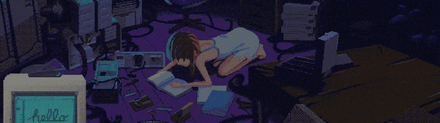

---

### `> sobre_mi`

- 🎓 Estudiante de un programa de **ciberseguridad**, enfocado en **diseño seguro de software**.
- 🔍 Aprendiendo y practicando **metodología de pentesting** y reportes estilo **OWASP / ASVS**.
- 🛠️ Trabajando en **Street-Web**, un proyecto grupal (Flask + React) para mapear incidentes urbanos, con su propio reporte de seguridad.
- 📡 Estudiando redes (Cisco) mientras avanzo en el programa.
- 🌱 Siempre curioseando entre código y consola.

---

### `> stack`

---

### `> stats`

---

### `> contribuciones`

⚙️ El "snake" de arriba se genera solo una vez configures la GitHub Action correspondiente (ver instrucciones abajo).

---

